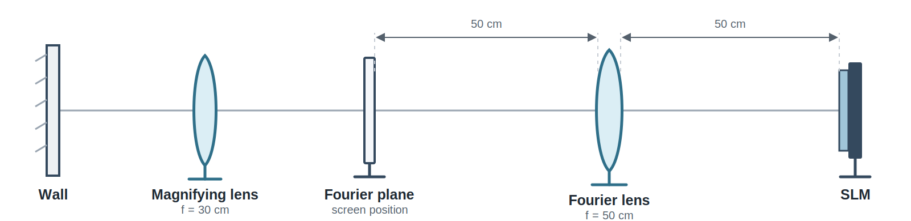
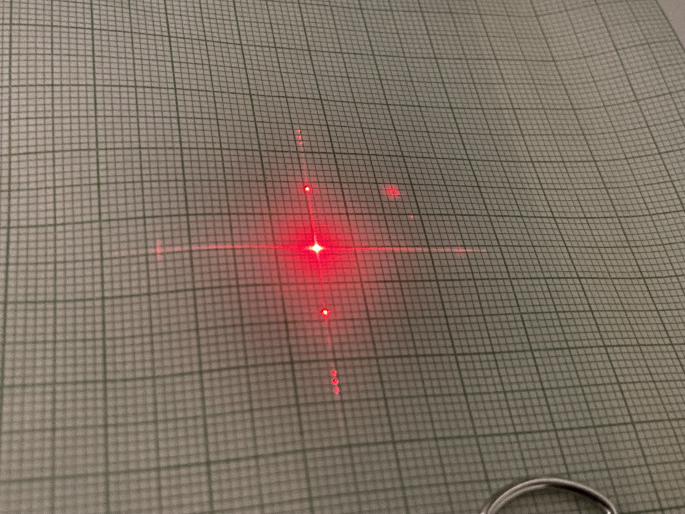
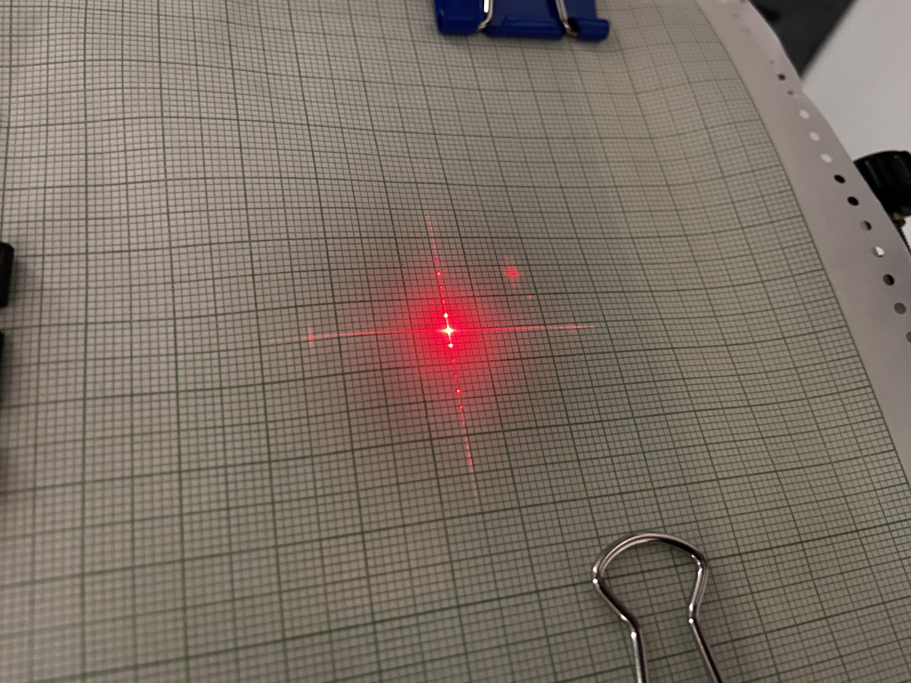
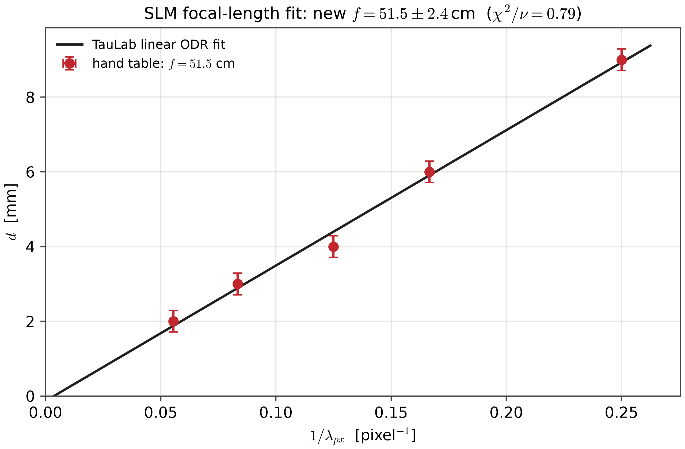
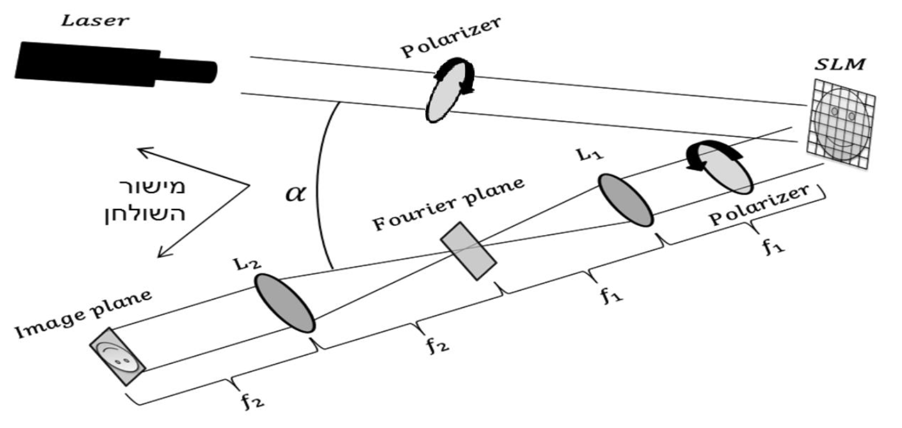
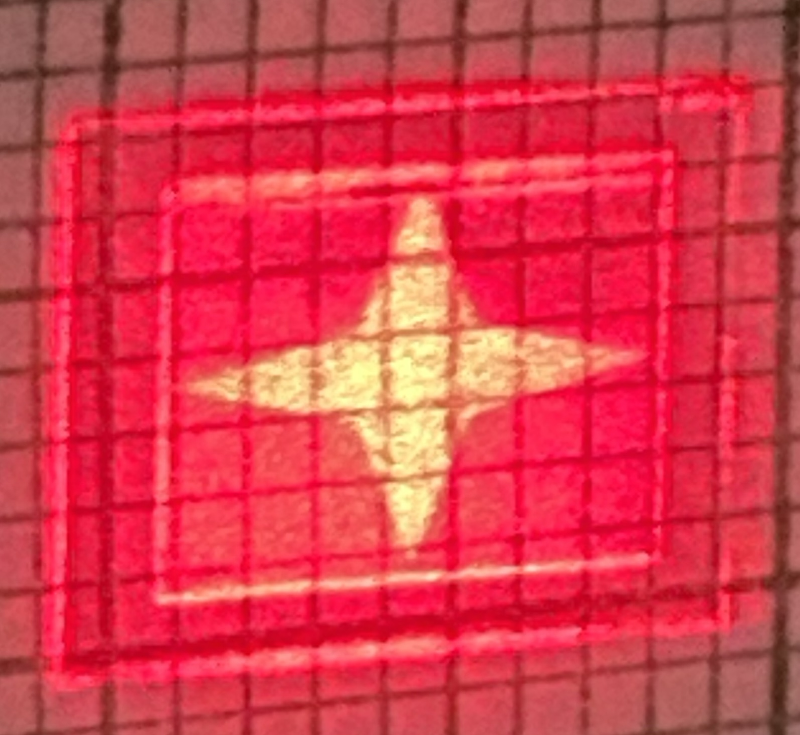
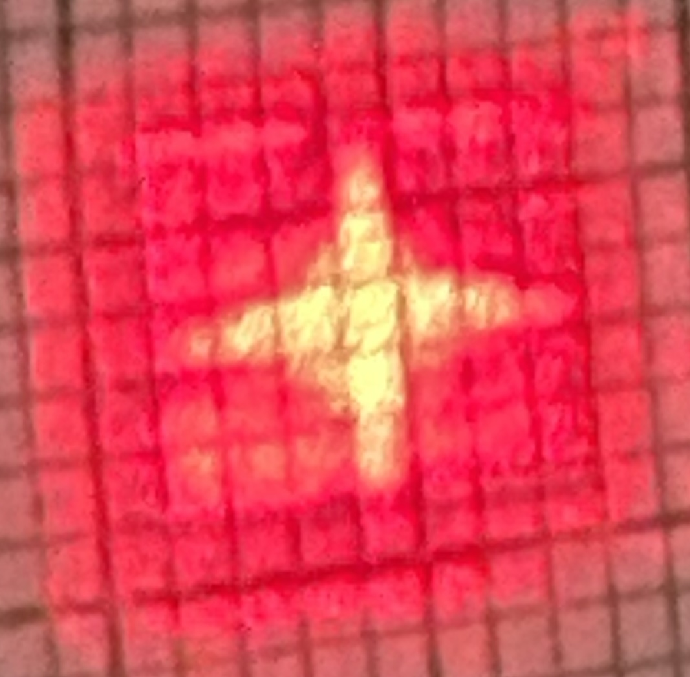
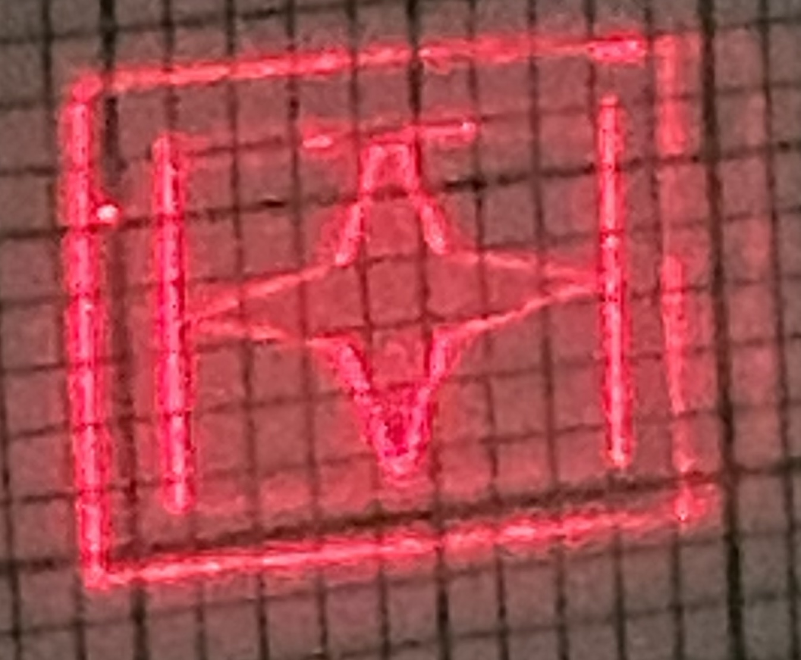
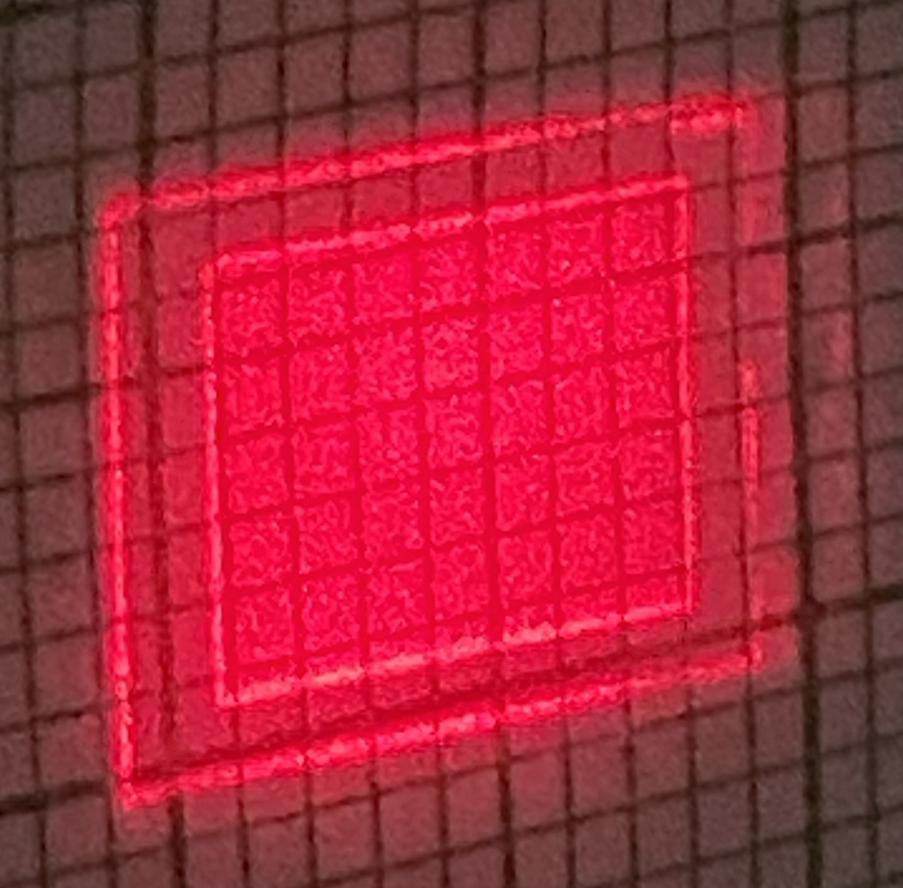
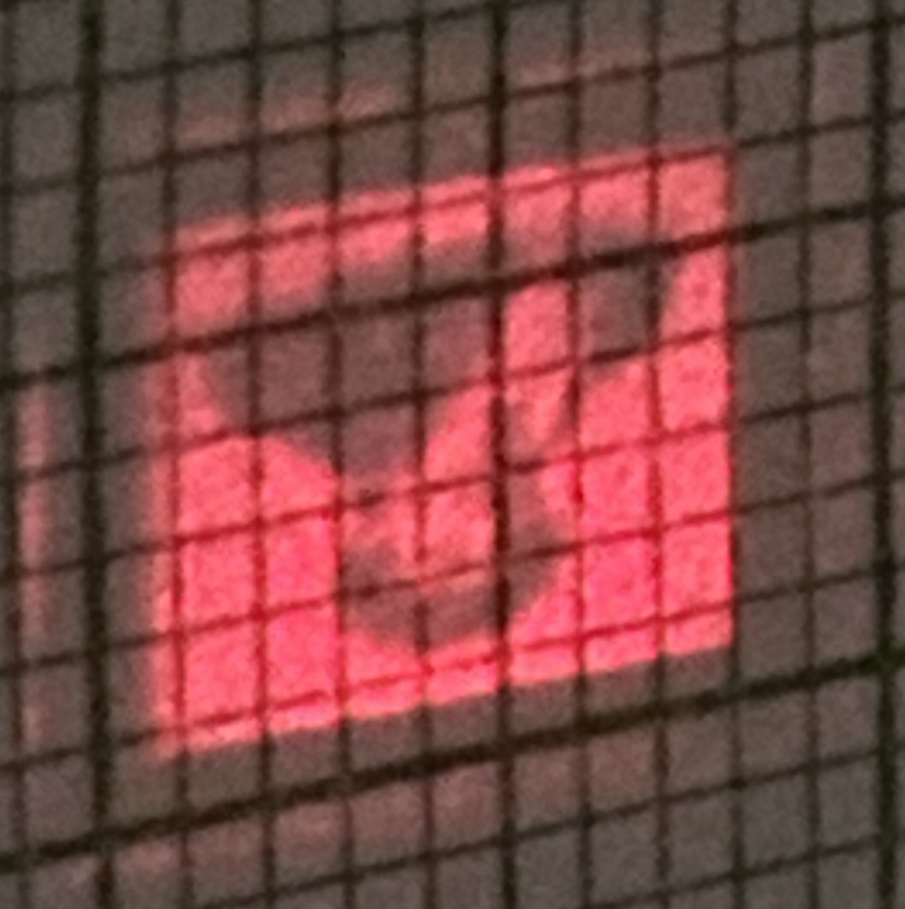

# SLM

**Itay Feldman and Tom Bleher**

## Week 1

We ensure that the SLM is aligned by projecting an image and moving the projection screen back and forth, seeing that the projected image remains in the same position and only scales. 

We build a 2f system by placing the Fourier plane at the focal point which we visually verify by giving the cosine and seeing the two light points on the screen. We use a $50\text{cm}$ lens placed $50\text{cm}$ from the SLM and place a screen $50\text{cm}$ away from the lens. At the end of the railway we place a $30\text{cm}$ lens to magnify the image on the wall.

<figure style="margin:20px auto; max-width:820px;">
  
  <figcaption style="text-align:center;">Optical layout used to locate the Fourier plane and magnify its pattern onto the wall.</figcaption>
</figure>

We want to observe the properties of the Fourier transform: linearity and convolution. For the linearity we give an input as $\cos_1(\frac{\pi}{2\lambda_{px}}x)$:and $$\cos2(\frac{2\pi}{\lambda_{px}}x)$$ where $\lambda=4$ (pixels).

Note the ratio $\frac{k_1}{k_2}=\frac{1}{4}$.

  <figure style="margin:0;">
    
    <figcaption style="text-align:center;">cos1</figcaption>
  </figure>
  <figure style="margin:0;">
    
    <figcaption style="text-align:center;">cos2</figcaption>
  </figure>
  <figure style="margin:0;">
    
    <figcaption style="text-align:center;">Linearity</figcaption>
  </figure>
  <figure style="margin:0;">
    
    <figcaption style="text-align:center;">convolution 1 (no linearity)</figcaption>
  </figure>
  <figure style="margin:0;">
    
    <figcaption style="text-align:center;">convolution 2</figcaption>
  </figure>

We will find the focal length of the lens by performing a linear fit of $y=mx+b$  where $y=x'$, $a=\lambda_{\text{laser}}\cdot f$, $x=1/\lambda_{\text{px}}$.
$$
x'=\theta \cdot f=f\frac{\lambda_{\text{laser}}\cdot k}{2\pi}=\frac{\lambda _{\text{laser}}}{\lambda_{\text{px}}}\cdot f
$$
The new dataset contains five measurements between $\lambda_{\text{px}}=4$ and $\lambda_{\text{px}}=20$, with $k=2\pi/\lambda_{\text{px}}$.  For the fit we only include points that landed on a clear grid line.

The spot displacement $d$ is read against millimeter graph paper. For the 1 mm scale resolution we assign uncertainty of $\sigma_d=1\text{ mm}/\sqrt{12}$. The horizontal coordinate $1/\lambda_{\text{px}}$ is set digitally and is effectively exact. We use TauLab to fit the linear model $d=b+m/\lambda_{\text{px}}$. The slope gives $f=mp/\lambda_{\text{laser}}$ with $p=9\,\mu\text{m}$ the SLM pixel pitch, while the intercept $b$ tests for a constant displacement offset.

| Result | Fit |
|---|---:|
| b [mm] | -0.13 ± 0.26 |
| m [mm] | 36.24 ± 1.69 (4.65%) |
| f [cm] | 51.5 ± 2.4 (4.7%) |
| χ²_red | 0.795 |
| p_val | 0.497 |

The focal-length uncertainty comes from the fitted slope. We use the course-guide pixel pitch $p=9.00\,\mu\text{m}$ without an uncertainty (wasn't specified).

<figure style="margin:0; max-width:720px;">
  
  <figcaption style="text-align:center;">Spot displacement d versus inverse grating period.</figcaption>
</figure>

## Week 2

We build a 4f system. We'll study the filtering of high and low spatial frequencies using the available optical components. We expect that filtering out the low frequencies will suppress the broad, slowly varying features and overall brightness of the image, emphasizing edges and fine details. Filtering out the high frequencies will instead remove sharp transitions and fine details, producing a smoother, blurred image.

<figure style="margin:20px auto; max-width:620px;">
  
  <figcaption style="text-align:center;">4f system. The lenses are separated by f1 + f2, and the Fourier plane lies at their shared focal plane.</figcaption>
</figure>

We choose $f_1=50\text{cm}$ and $f_2=40\text{cm}$. It was hard to see the effect using the image of Fourier so we created a new image comprised of multiple frequency cosines to see the effect clearly over discrete freuqencies. To see the effect more clearly, we display a star image and compare the unfiltered reconstruction with the two spatial-frequency filters.

  <figure style="margin:0;">
    
    <figcaption style="text-align:center;">Unfiltered image</figcaption>
  </figure>
  <figure style="margin:0;">
    
    <figcaption style="text-align:center;">Low-frequency components retained</figcaption>
  </figure>
  <figure style="margin:0;">
    
    <figcaption style="text-align:center;">High-frequency components retained</figcaption>
  </figure>

We now investigate optical encryption. We multiply the image signal $I(x)$ by a cosine carrier with spatial frequency $k$,
$$
I_{\mathrm{enc}}(x)=I(x)\cos(kx).
$$
Multiplication in real space becomes convolution in Fourier space. Since the Fourier transform of the cosine contains two delta functions at $\pm k$, the image spectrum is copied and shifted to both $+k$ and $-k$:
$$
\widetilde{I}_{\mathrm{enc}}(q)=\frac{1}{2}\left[\widetilde{I}(q-k)+\widetilde{I}(q+k)\right].
$$
We choose a sufficiently large value of $k$ so that the two shifted spectra are clearly separated in the Fourier plane. The directly reconstructed image appears scrambled because it remains modulated by the cosine carrier. To decrypt it, we block the DC component and one of the shifted spectra in the Fourier plane, allowing only the other shifted copy to pass. The reconstructed output then recovers the original image without the visible carrier modulation.

  <figure style="margin:0;">
    
    <figcaption style="text-align:center;">Encrypted image</figcaption>
  </figure>
  <figure style="margin:0;">
    
    <figcaption style="text-align:center;">Decrypted image</figcaption>
  </figure>

