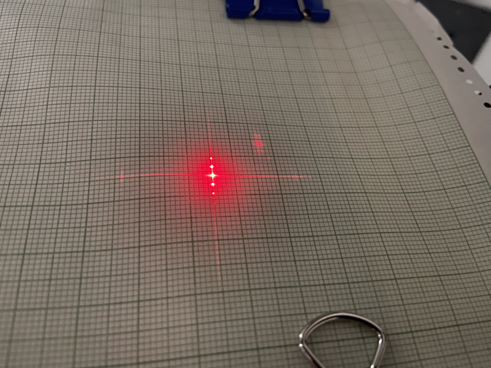
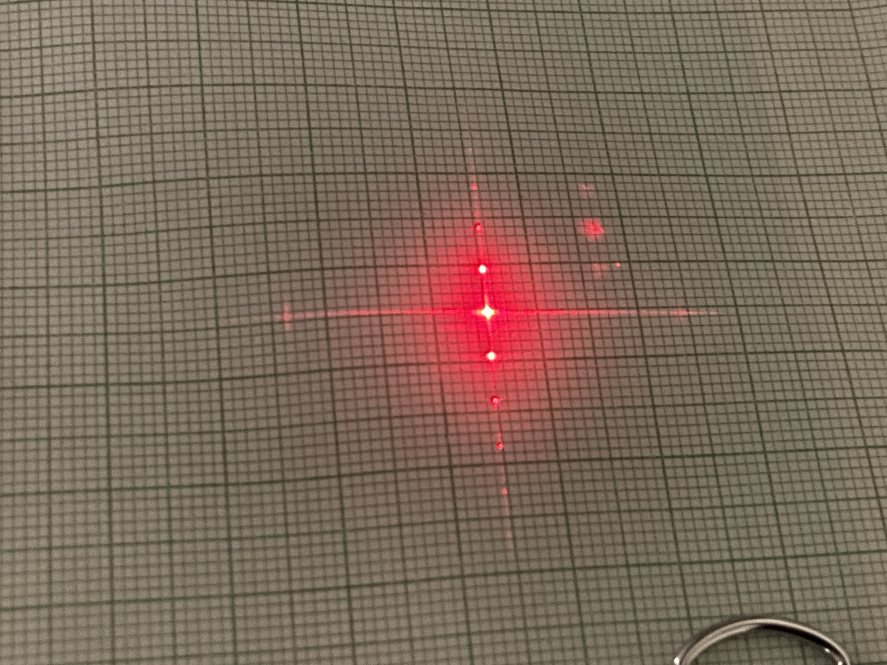
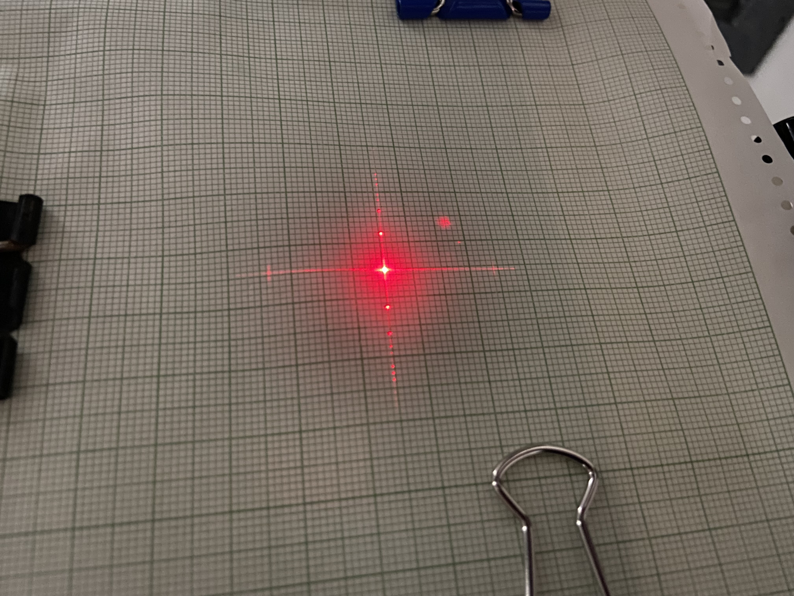

# SLM

## Week 1

We ensure that the SLM is aligned by projecting an image and moving the projection screen back and forth, seeing that the projected image remains in the same position and only scales. We build a 2f system by placing the Fourier plane at the focal point which we visually verify by giving the cosine and seeing the two light points on the screen. We use a $50\text{cm}$ lens placed $50\text{cm}$ from the SLM and place a screen $50\text{cm}$ away from the lens. At the end of the railway we place a $30\text{cm}$ lens to magnify the image on the wall.
$$
\text{screen}-50\text{cm}-\text{lens}-50\text{cm}-\text{SLM}
$$
We want to show the properties of the Fourier transform: linearity and convolution. For the linearity we give an input as $\cos_1(\frac{\pi}{2\lambda_{px}}x)$:and $$\cos2(\frac{2\pi}{\lambda_{px}}x)$$ where $\lambda=4$.

Note the ratio $\frac{k_1}{k_2}=\frac{1}{4}$.

  <figure style="margin:0;">
    
    <figcaption style="text-align:center;">cos1</figcaption>
  </figure>
  <figure style="margin:0;">
    
    <figcaption style="text-align:center;">cos2</figcaption>
  </figure>
  <figure style="margin:0;">
    
    <figcaption style="text-align:center;">Linearity</figcaption>
  </figure>
  <figure style="margin:0;">
    
    <figcaption style="text-align:center;">convolution 1 (no linearity)</figcaption>
  </figure>
  <figure style="margin:0;">
    
    <figcaption style="text-align:center;">convolution 2</figcaption>
  </figure>

We will find the focal length of the lens by performing a linear fit of $y=mx+b$  where $y=x'$, $a=\lambda_{\text{laser}}\cdot f$, $x=1/\lambda_{\text{px}}$  and $b=0$.
$$
x'=\theta \cdot f=f\frac{\lambda_{\text{laser}}\cdot k}{2\pi}=\frac{\lambda _{\text{laser}}}{\lambda_{\text{px}}}\cdot f
$$
we began with $\lambda_{\text{px}}=4$ raising for each step until $\lambda{\text{px}}=20$ for a total of 9 measurments with $k=2\pi/\lambda_{\text{px}}$.
